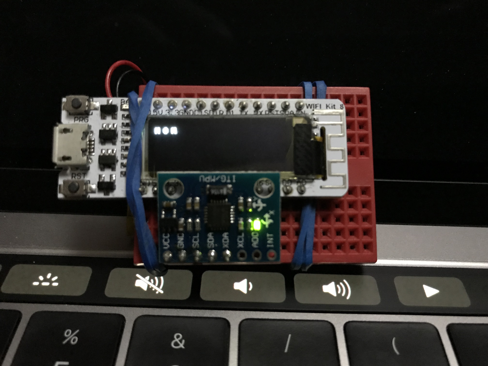
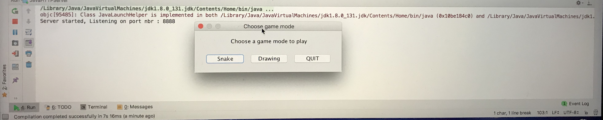
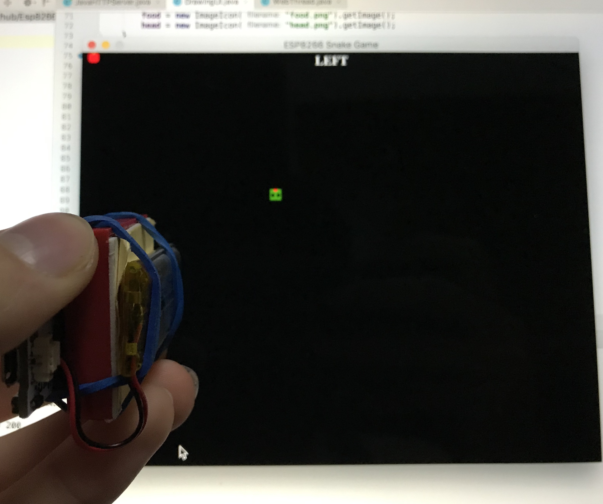
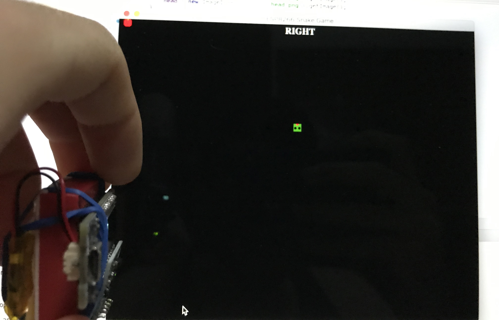
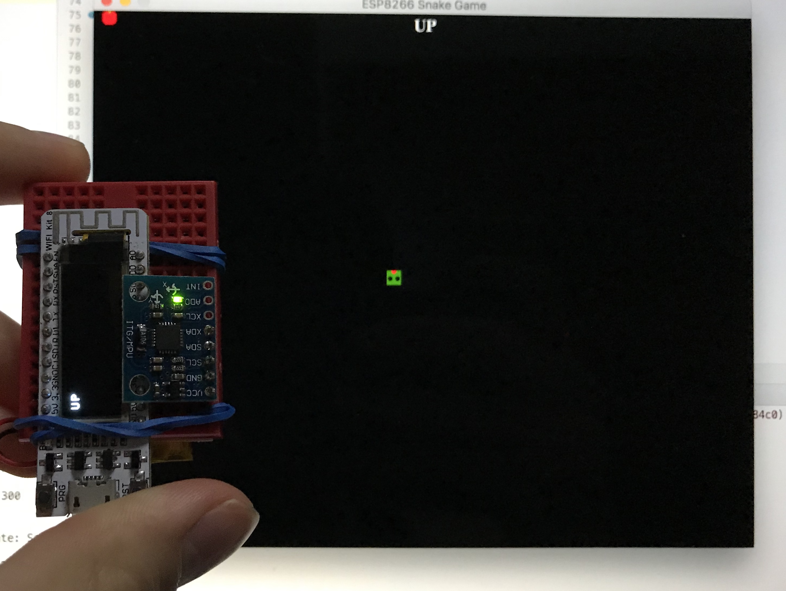
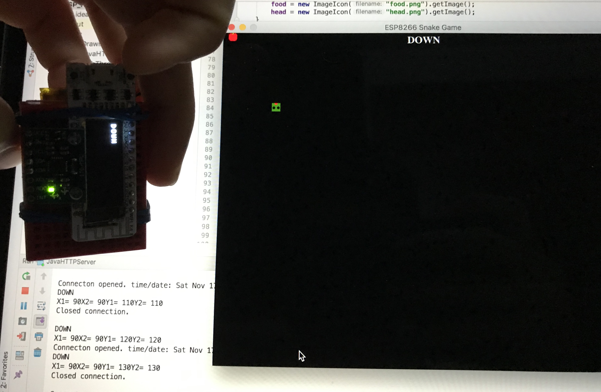

# ESP8266-Heltec-Drawing-or-Snake-Game
A hobby project created by me Hadi Deknache, uses a microcontroller, which predicts the state(Up, Down, Left, Right) and sends to a java application to either draw an image or play old school snake game

## Microcontroller prototype Heltec wifi kit 8

### Java application

### Different states of the devices

#### Left

#### Right

#### Up

#### Down

